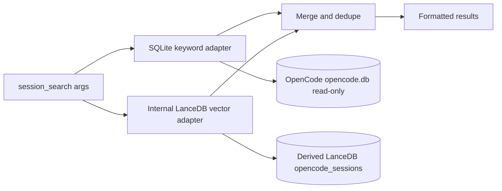

# Session Search Hybrid Spec

## Status

Implemented for PR review in `fix/session-search-sql-vector`.

## Goal

`session_search` must search current OpenCode session history without scanning legacy JSON files. The primary path is a read-only SQLite keyword search against OpenCode's canonical `opencode.db`; the optional enhancement path queries an internal LanceDB-derived vector index for semantic matches.

## Non-Goals

- Do not mutate or migrate OpenCode's source SQLite database.
- Do not require LanceDB or embedding dependencies for keyword search to work.
- Do not use the vector adapter as a second source-DB keyword fallback; direct SQL owns source DB fallback.

## Architecture



## Data Sources

### OpenCode SQLite Source

The SQL adapter supports the current OpenCode tables and columns:

- `session.id`, `session.title`
- `message.id`, `message.session_id`, `message.time_created`, `message.data`
- `part.id`, `part.message_id`, `part.session_id`, `part.data`

The database is opened with Bun SQLite `readonly: true` and `PRAGMA query_only = ON`. Path resolution follows OpenCode's data directory shape:

1. `OPENCODE_DB=:memory:` or an absolute `OPENCODE_DB` path is used as-is.
2. A relative `OPENCODE_DB` is resolved under `${XDG_DATA_HOME:-~/.local/share}/opencode/`.
3. `OPENCODE_CHANNEL` uses `opencode-<channel>.db` unless the channel is `latest`, `beta`, `prod`, or `OPENCODE_DISABLE_CHANNEL_DB` is set.
4. The default is `${XDG_DATA_HOME:-~/.local/share}/opencode/opencode.db`.

### Derived Vector Index

The vector adapter is optional and uses an internal LanceDB runtime with an HTTP embedding client. It does not invoke external scripts or depend on external knowledge-base paths.

**Build is separate from query.** The vector index must be built ahead of time via the CLI:

```bash
oh-my-opencode session-vector build [--db <path>] [--index <path>] [--manifest <path>] [--limit <n>] [--json]
```

The build command reads OpenCode's SQLite database read-only, extracts text from session messages and parts, embeds each chunk through the configured HTTP embedding endpoint, and writes the derived LanceDB index plus a manifest file. The source database is never mutated; its checksum is verified before and after the build.

The manifest records per-source build statistics: `sessions`, `messages`, `parts`, `chunks`, `source_bytes`, and `source_sha256`. These fields are strict schema requirements; a manifest missing any of them fails validation and causes the vector adapter to return `[]`.

**Query path** (`session_search`) only reads the pre-built index. It resolves the vector runtime environment, loads the manifest, validates it against the `opencode` source namespace, embeds the query string, and searches LanceDB. If any step fails (missing config, missing index, missing manifest, embedding error, LanceDB error), the vector adapter returns `[]` and SQL keyword results continue unaffected.

#### Environment Variables

| Variable | Required | Purpose |
|----------|----------|---------|
| `AGENT_EMBEDDING_ENDPOINT` | Yes (for vector) | HTTP embedding API endpoint (OpenAI-compatible protocol) |
| `AGENT_EMBEDDING_MODEL` | Yes (for vector) | Embedding model name |
| `AGENT_EMBEDDING_DIMENSIONS` | Yes (for vector) | Embedding vector dimensions (positive integer) |
| `AGENT_EMBEDDING_API_KEY` | No | API key for the embedding endpoint |
| `AGENT_VECTOR_DB_PATH` | No | Vector index directory path (overridden by `--index` in build, used by query) |
| `AGENT_VECTOR_MANIFEST` | No | Manifest JSON file path (overridden by `--manifest` in build, used by query) |
| `AGENT_VECTOR_DB_BACKEND` | No | Backend selection (`lancedb`, `qdrant`, `noop`). When unset, query defaults to `lancedb` using the internal LanceDB cache path; when set to a non-lancedb backend, vector query returns `[]`. |
| `AGENT_VECTOR_TIMEOUT_MS` | No | Timeout for vector operations in milliseconds |

#### Cache Path Resolution

When `AGENT_VECTOR_DB_PATH` and `AGENT_VECTOR_MANIFEST` are not set, the build and query paths fall back to XDG cache:

- Index: `${XDG_CACHE_HOME:-~/.cache}/oh-my-opencode/vector/opencode-sessions`
- Manifest: `${XDG_CACHE_HOME:-~/.cache}/oh-my-opencode/vector/vector-manifest.json`

#### Missing Index / Config Behavior

Vector search is non-fatal. The following conditions each cause the vector adapter to return `[]` while SQL keyword search continues:

- `AGENT_VECTOR_DB_BACKEND` is set to a non-lancedb backend (e.g., `qdrant`, `noop`)
- `AGENT_VECTOR_DB_PATH` is not configured and the cache default does not exist
- `AGENT_EMBEDDING_ENDPOINT` is not configured
- The LanceDB index directory does not exist on disk
- `AGENT_VECTOR_MANIFEST` is not configured and the cache default does not exist
- The manifest file is missing, malformed, or fails schema validation
- The manifest does not contain the `opencode` source namespace
- The embedding HTTP request fails or returns an error
- The LanceDB query fails (missing table, schema mismatch, etc.)

#### Source Database Immutability

OpenCode's SQLite database is opened with `readonly: true` and `PRAGMA query_only = ON`. The vector build verifies the source database checksum before and after reading to guarantee no mutation occurs. Vector data is always derived and rebuildable: deleting the LanceDB index and manifest and re-running `session-vector build` produces identical results from the same source database.

## Query Semantics

- Empty or whitespace-only queries return no matches.
- SQL tokenization uses word, number, underscore, hyphen, and CJK character runs.
- Multi-token SQL queries are OR-style: any token can produce a result.
- `case_sensitive` applies only to SQL keyword search. Semantic vector search is not case-sensitive.
- Literal `%` and `_` are treated as normal characters because SQL matching uses `instr()` rather than `LIKE`.
- SQL result excerpts are built from the exact matched `part.data` for part hits. Supported displayed fields include `text`, legacy `thinking`, reasoning `text`, tool `state.title`, tool `state.output`, `prompt`, and `description`; if a hit only appears in raw JSON, the excerpt is marked as `data`.

## Session Filter Semantics

- SQL applies `session_id` in the SQLite query.
- Vector results are filtered client-side because the internal vector adapter performs session filtering after the LanceDB query. The caller requests extra vector candidates (`limit * 4`) before local filtering to reduce missed results.
- If adapter-side session filtering is added later, it should preserve the same public `session_search` argument and result contract.

## Merge, Dedupe, and Ranking

- Results are deduplicated by `session_id:message_id`.
- SQL results are inserted before vector results, so exact keyword evidence wins when both sources identify the same message.
- Each backend normalizes scores into a 0-1 relevance range before merge.
- Final sorting is by normalized score descending, then truncated to `limit`.
- Formatted output tags vector results with `[vector]`; SQL results are untagged.

## Failure Modes

- Missing `opencode.db`: SQL returns no results.
- SQL schema mismatch or query failure: SQL degrades to no results; vector can still return matches.
- Missing vector config, index, or manifest: vector returns no results; SQL can still return matches.
- Vector timeout: the adapter returns no results after the configured timeout.

## Performance Boundaries

The SQL adapter is a read-only keyword fallback, not the long-term indexing layer. It uses `instr()` over JSON text in `message.data` and `part.data`, so it cannot use ordinary OpenCode indexes for the text predicate and may scan large tables. `session_search` therefore keeps SQL bounded by token count and result limit, and avoids pretending a synchronous SQLite scan is cancellable. Large-install semantic performance should be improved in the derived LanceDB `opencode_sessions` index, not by mutating OpenCode's source database or adding source DB indexes.

## Test Matrix

Required self-tests for this PR:

```bash
bun test --timeout 30000 src/tools/session-manager/
bun run typecheck
bun test --timeout 30000
bun run build
```

Coverage requirements:

- `sql-search.test.ts`: SQL matching, case sensitivity, `session_id`, limit, literal `%/_`, CJK, matched-part excerpt evidence, empty input.
- `vector-adapter.test.ts`: missing config, missing index, missing manifest, embedding failure, LanceDB query failure, source filtering, client-side session filtering, same-session multi-hit preservation, dedupe, real-env no-create guard.
- `utils.test.ts`: merge/dedupe behavior, score sorting, limit truncation.
- `tools.test.ts`: end-to-end `session_search` wiring for SQL-only, vector fallback after SQL schema failure, and vector `session_id` filtering.

## Acceptance Criteria

- OpenCode source database remains read-only and unchanged.
- Vector integration remains optional and derived-index-only.
- `SESSION_SEARCH_DESCRIPTION` and `docs/features.md` match the hybrid behavior.
- All required self-tests pass before the PR is considered review-ready.

# References

- `src/tools/session-manager/tools.ts`
- `src/tools/session-manager/sql-search.ts`
- `src/tools/session-manager/vector-adapter.ts`
- `src/tools/session-manager/utils.ts`
- `src/tools/session-manager/constants.ts`
- `docs/features.md`
