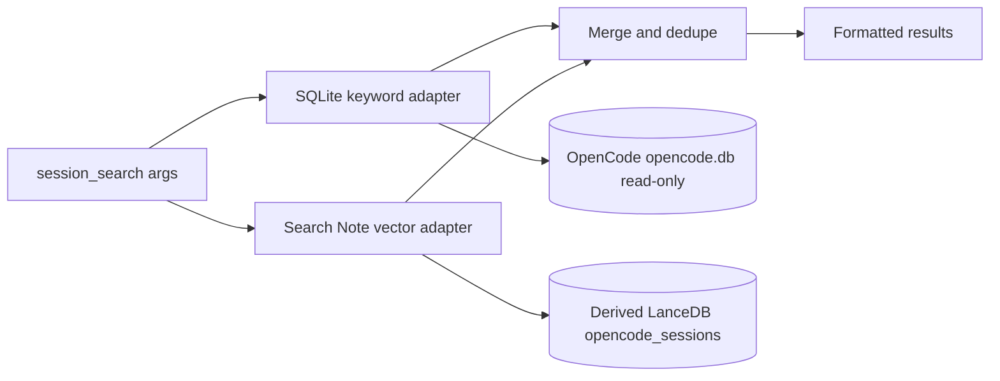

# Session Search Hybrid Spec

## Status

Implemented for PR review in `fix/session-search-sql-vector`.

## Goal

`session_search` must search current OpenCode session history without scanning legacy JSON files. The primary path is a read-only SQLite keyword search against OpenCode's canonical `opencode.db`; the optional enhancement path queries a derived Search Note vector index for semantic matches.

## Non-Goals

- Do not mutate or migrate OpenCode's source SQLite database.
- Do not require Search Note, LanceDB, or Python dependencies for keyword search to work.
- Do not use the vector adapter as a second source-DB keyword fallback; direct SQL owns source DB fallback.

## Architecture



## Data Sources

### OpenCode SQLite Source

The SQL adapter supports the current OpenCode tables and columns:

- `session.id`, `session.title`
- `message.id`, `message.session_id`, `message.time_created`, `message.data`
- `part.id`, `part.message_id`, `part.session_id`, `part.data`

The database is opened with Bun SQLite `readonly: true` and `PRAGMA query_only = ON`. Path resolution follows OpenCode's data directory shape:

1. `OPENCODE_DB=:memory:` or an absolute `OPENCODE_DB` path is used as-is.
2. A relative `OPENCODE_DB` is resolved under `${XDG_DATA_HOME:-~/.local/share}/opencode/`.
3. `OPENCODE_CHANNEL` uses `opencode-<channel>.db` unless the channel is `latest`, `beta`, `prod`, or `OPENCODE_DISABLE_CHANNEL_DB` is set.
4. The default is `${XDG_DATA_HOME:-~/.local/share}/opencode/opencode.db`.

### Derived Vector Index

The vector adapter is optional. It discovers `query_lancedb.py` from `OMO_SESSION_SEARCH_VECTOR_ADAPTER` first, then known Search Note locations. It invokes:

```bash
python3 query_lancedb.py <query> --source opencode --mode semantic --top-k <n> --opencode-db <nonexistent-db>
```

`--mode semantic` and a unique nonexistent `--opencode-db` keep this path constrained to the derived `opencode_sessions` LanceDB table. If the derived index, adapter script, Python, LanceDB, or embedding backend is unavailable, the adapter returns no results and SQL search remains available.

## Query Semantics

- Empty or whitespace-only queries return no matches.
- SQL tokenization uses word, number, underscore, hyphen, and CJK character runs.
- Multi-token SQL queries are OR-style: any token can produce a result.
- `case_sensitive` applies only to SQL keyword search. Semantic vector search is not case-sensitive.
- Literal `%` and `_` are treated as normal characters because SQL matching uses `instr()` rather than `LIKE`.
- SQL result excerpts are built from the exact matched `part.data` for part hits. Supported displayed fields include `text`, legacy `thinking`, reasoning `text`, tool `state.title`, tool `state.output`, `prompt`, and `description`; if a hit only appears in raw JSON, the excerpt is marked as `data`.

## Session Filter Semantics

- SQL applies `session_id` in the SQLite query.
- Vector results are filtered client-side because the current Search Note adapter contract does not expose adapter-side `session_id` filtering. The caller requests extra vector candidates (`limit * 4`) before local filtering to reduce missed results.
- If adapter-side session filtering is added later, it should preserve the same public `session_search` argument and result contract.

## Merge, Dedupe, and Ranking

- Results are deduplicated by `session_id:message_id`.
- SQL results are inserted before vector results, so exact keyword evidence wins when both sources identify the same message.
- Each backend normalizes scores into a 0-1 relevance range before merge.
- Final sorting is by normalized score descending, then truncated to `limit`.
- Formatted output tags vector results with `[vector]`; SQL results are untagged.

## Failure Modes

- Missing `opencode.db`: SQL returns no results.
- SQL schema mismatch or query failure: SQL degrades to no results; vector can still return matches.
- Missing vector adapter or derived index: vector returns no results; SQL can still return matches.
- Vector timeout: the adapter returns no results after the configured timeout.

## Performance Boundaries

The SQL adapter is a read-only keyword fallback, not the long-term indexing layer. It uses `instr()` over JSON text in `message.data` and `part.data`, so it cannot use ordinary OpenCode indexes for the text predicate and may scan large tables. `session_search` therefore keeps SQL bounded by token count and result limit, and avoids pretending a synchronous SQLite scan is cancellable. Large-install semantic performance should be improved in the derived Search Note `opencode_sessions` index, not by mutating OpenCode's source database or adding source DB indexes.

## Test Matrix

Required self-tests for this PR:

```bash
bun test --timeout 30000 src/tools/session-manager/
bun run typecheck
bun test --timeout 30000
bun run build
```

Coverage requirements:

- `sql-search.test.ts`: SQL matching, case sensitivity, `session_id`, limit, literal `%/_`, CJK, matched-part excerpt evidence, empty input.
- `vector-adapter.test.ts`: missing adapter, subprocess failure, malformed JSON, stderr tolerance, timeout, source filtering, client-side session filtering, same-session multi-hit preservation, derived-only semantic invocation.
- `utils.test.ts`: merge/dedupe behavior, score sorting, limit truncation.
- `tools.test.ts`: end-to-end `session_search` wiring for SQL-only, vector fallback after SQL schema failure, and vector `session_id` filtering.

## Acceptance Criteria

- OpenCode source database remains read-only and unchanged.
- Search Note/vector integration remains optional and derived-index-only.
- `SESSION_SEARCH_DESCRIPTION` and `docs/features.md` match the hybrid behavior.
- All required self-tests pass before the PR is considered review-ready.

# References

- `src/tools/session-manager/tools.ts`
- `src/tools/session-manager/sql-search.ts`
- `src/tools/session-manager/vector-adapter.ts`
- `src/tools/session-manager/utils.ts`
- `src/tools/session-manager/constants.ts`
- `docs/features.md`
