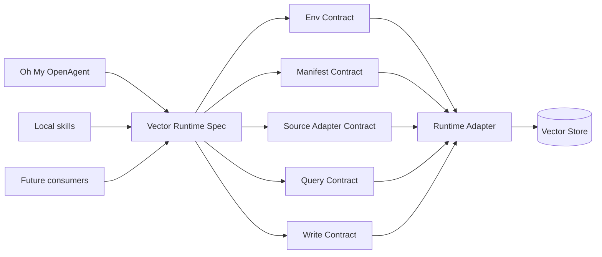

# Vector Runtime Spec

## Status

Draft.

## Goal

定义一份稳定的 Vector Runtime 协议，让 Oh My OpenAgent 与本地 skills 通过共享的 environment、manifest、source adapter、query、write、concurrency 与 security contract 实现 vector retrieval，而不是各自耦合到特定 backend、路径或实现细节。两端都可以 query，也都可以写入 derived vector data，但所有操作必须遵守同一套协议。

## Non-Goals

- 不让 OMO 依赖任何 skill 的内部实现。
- 不让任何 skill 依赖 OMO 的内部实现。
- 不在 vector indexing 过程中修改 source database。
- 不把 user home、repo checkout 或特定 vector store 的 storage assumption 硬编码进 caller。
- 不允许多个 writer 各自发明不兼容的 chunk ID、schema、manifest 或 embedding setting。

## Core Principle

```text
Share the contract, not the implementation.
```

OMO、本地 skills 与未来的 consumers 只耦合到 Vector Runtime Spec。Runtime adapter 决定 backing store 是本地 LanceDB、远端 Qdrant、其他 vector database，还是 test fixture。



## Env Contract

环境变量只描述 runtime wiring，不承载 source-specific business logic。source selection 属于 query / source adapter contract，不放在全局 env。

| Variable | Required | Meaning |
|---|---:|---|
| `AGENT_VECTOR_DB_BACKEND` | no | Vector backend 标识，例如 `lancedb` 或 `qdrant`。 |
| `AGENT_VECTOR_DB_PATH` | no | Filesystem backend 使用的本地 vector database path。 |
| `AGENT_VECTOR_DB_URI` | no | Service backend 使用的远端 vector database URI。 |
| `AGENT_VECTOR_DB_API_KEY` | no | Vector database credential。 |
| `AGENT_VECTOR_MANIFEST` | no | Manifest file path 或 URI。 |
| `AGENT_EMBEDDING_ENDPOINT` | no | Embedding API endpoint。 |
| `AGENT_EMBEDDING_API_KEY` | no | Embedding API credential。 |
| `AGENT_EMBEDDING_MODEL` | no | Query vector 与 indexed chunk 使用的 embedding model。 |
| `AGENT_EMBEDDING_DIMENSIONS` | no | Embedding vector dimension count。 |
| `AGENT_VECTOR_TIMEOUT_MS` | no | Query 或 write operation 的 timeout budget。 |

Caller 必须把任何默认路径视为 default only。显式环境变量永远优先。

## Manifest Contract

Manifest 是 query vector、stored vector、source schema 与 writer behavior 之间的兼容性校验点。Runtime 在返回 semantic results 或执行 write 前必须校验 manifest。

Manifest 描述的是 runtime 级别的配置，不绑定到特定 consumer 的目录结构或 table 命名。每个 source namespace 在 manifest 中声明自己的 schema version、source-of-truth 类型与 freshness。

```json
{
  "contract_version": "vector-runtime/v1",
  "backend": "<backend-identifier>",
  "db_path": "<vector-store-path>",
  "embedding": {
    "provider": "<provider-type>",
    "endpoint": "<embedding-api-endpoint>",
    "model": "<model-identifier>",
    "dimensions": 1536
  },
  "sources": {
    "<source-namespace>": {
      "table": "<table-name>",
      "schema_version": "<schema-version-identifier>",
      "source_of_truth": "<database|external-system>",
      "last_indexed_at": "<ISO-8601-timestamp>"
    }
  }
}
```

Manifest 中的 `sources` 条目由 source adapter 在 index 时注册。Consumer 通过 manifest 发现可用的 source namespace 及其 schema version，而不是通过硬编码的 table name 或文件路径。

## Invariants

- `INV-1`: Query vector 必须使用与目标 source table 相同的 embedding model 与 dimensions 生成。
- `INV-2`: Write 必须拒绝 schema version 与目标 source namespace 不匹配的 chunks。
- `INV-3`: 相同 source object 与 chunk content 必须生成 deterministic chunk ID。
- `INV-4`: Source systems 始终是 source of truth；vector tables 是 derived 且可重建。
- `INV-5`: Runtime caller 不能只因为 vector query 成功就推断 index fresh；freshness 只能来自 manifest。
- `INV-6`: 多个 caller 可以写入，但必须使用同一套 write protocol 与 manifest update rules。

## Source Adapter Contract

Source adapter 是 source-of-truth 与 vector store 之间的桥接层。每个 source namespace 对应一个 source adapter，负责：

- 声明 namespace identity 与 schema version。
- 定义 canonical record identity：source object 在 source-of-truth 中的唯一标识方式。
- 定义 chunk identity：如何从 source record 派生 deterministic chunk ID 与 chunk hash。
- 定义 freshness：如何判断 source-of-truth 中的 record 是否比 vector store 中的 chunk 更新。
- 将 source records 转换为符合 row schema 的 chunks。
- 在 source-of-truth 不可达时，以明确的 failure mode 降级，不产生部分写入或损坏的 derived state。

Source adapter 不拥有 vector store 的写入逻辑。写入逻辑由 Write Contract 统一约束。Source adapter 只负责"从 source 读到什么、如何切分为 chunks、如何标识 chunk identity"。

## SQLite Source Adapter Contract

当 source-of-truth 是 SQLite database 时，source adapter 必须遵守以下额外约束：

### Authority

SQLite source database 是 authoritative 且 read-only。Source adapter 只能以只读模式打开 source database。任何情况下，derived vector data 的写入、更新、删除操作都不得 mutate source database 的 schema、table、row 或任何 byte。

### Namespace and Schema

Source adapter 必须在 manifest 中为对应的 source namespace 声明：

- `source_of_truth`: 固定为 `database`。
- `schema_version`: 与 source database schema 绑定的版本标识。source database schema 变更时，schema version 必须随之变更，旧 schema version 的 chunks 必须被视为 stale。
- `table`: vector store 中该 namespace 对应的 table name。

### Canonical Record Identity

Source adapter 必须定义如何从 source database 的 row 派生 canonical record identity。Record identity 是 chunk identity 的前置输入。它必须满足：

- 在 source database 的生命周期内唯一且稳定。
- 不依赖 rowid 等可能因 VACUUM 或重建而变化的内部标识。
- 优先使用业务主键或复合业务键。

### Chunk Identity

Source adapter 必须定义如何从 canonical record identity 与 chunk content 派生 deterministic chunk ID 与 chunk hash。同一 source record 的同一段 content 在任何时间、任何 writer 上都必须生成相同的 chunk ID。

### Freshness

Source adapter 必须定义 freshness 判断逻辑：给定一个 source record 和一个 vector store chunk，如何判断 chunk 是否需要 re-index。Freshness 可以基于 source record 的 modification timestamp、version column、content hash 对比，或这些方式的组合。

### Failure Degradation

当 source database 不可达、schema 不兼容、或 record 读取失败时，source adapter 必须：

- 不写入任何 partial chunks。
- 不修改 manifest 中的 `last_indexed_at`。
- 返回明确的 error diagnostic，包含 failure scope（全量 / 单 record）与原因。
- 不静默跳过 record 并报告 index 成功。

## Query Contract

Query caller 提交 normalized request。`source` 字段指定目标 source namespace，由 source adapter contract 定义其语义。

```json
{
  "query": "<natural-language-query>",
  "source": "<source-namespace>",
  "mode": "semantic",
  "top_k": 10,
  "filters": {
    "<field>": "<value>"
  }
}
```

Runtime adapter 返回 normalized results：

```json
{
  "results": [
    {
      "source": "<source-namespace>",
      "chunk_id": "<deterministic-chunk-id>",
      "score": 0.87,
      "text": "<matched-chunk-text>",
      "metadata": {
        "<key>": "<value>"
      }
    }
  ],
  "diagnostics": {
    "backend": "<backend-identifier>",
    "manifest_validated": true,
    "semantic_available": true
  }
}
```

Semantic query failure 必须降级为 no semantic results + diagnostics。它不能静默查询无关 source namespace、临时 rebuild index，或通过意外 fallback path 读取 source database。

## Write Contract

Runtime 支持 multiple writers through one shared protocol。这不是 single-writer ownership，而是 single write semantics。

```text
Single Write Contract, Multiple Writers.
```

所有 writer 必须遵守同一协议步骤。

### Step 1: Resolve Runtime

Writer 从 Env Contract 解析 backend、database location、embedding settings、manifest location、timeout 与 target source namespace。

### Step 2: Validate Manifest

Writer 校验 `contract_version`、backend compatibility、embedding model、dimensions、source table 与 schema version。若目标 source namespace 不存在，writer 只能通过同一 manifest schema 初始化它。

### Step 3: Build Chunks

Writer 通过 source adapter 将 source records 转为包含 deterministic `chunk_id`、`chunk_text`、`metadata`、`chunk_hash` 与 `schema_version` 的 rows。

### Step 4: Embed Chunks

Writer 使用 manifest-compatible embedding runtime 生成 embeddings。若 embedding dimensions 异常，writer 必须拒绝写入。

### Step 5: Apply Delta

Writer 通过 `source + chunk_id` 执行 upsert 与 delete。Delete 用于移除 source object 已不存在或 chunk identity 已变化的 derived chunks。

### Step 6: Commit Manifest

Writer 必须与 vector table update 原子地或紧随其后更新 freshness 与 source statistics。部分更新完成的 vector table 不能被报告为 fresh。

## Concurrency Contract

Runtime adapter 必须提供以下并发保证之一：

| Backend Shape | Required Guarantee |
|---|---|
| Local filesystem backend | Process-level writer lock + atomic manifest replace。 |
| Remote vector service | Backend transaction、compare-and-swap revision 或等价 optimistic concurrency。 |
| Test fixture | Deterministic single-process behavior。 |

如果 backend 能隔离 table 与 manifest updates，不同 source namespace 的并发 writer 可以并行。同一 source namespace 的并发 writer 必须 serialize，或 fail fast 并返回 retryable diagnostic。

## Security Contract

- API keys 从 environment variables 或 runtime configuration 指向的 local secret files 读取。
- API keys 不得写入 manifests、vector rows、logs、diagnostics 或 test fixtures。
- Query diagnostics 可以包含 provider name、backend name、model name 与 dimensions，但不能包含 credentials。

## Failure Modes

| Failure | Required Behavior |
|---|---|
| Missing manifest | Query 返回 no semantic results；explicit write operation 才能初始化。 |
| Embedding model mismatch | 拒绝该 source namespace 的 query 或 write。 |
| Dimension mismatch | 拒绝该 source namespace 的 query 或 write。 |
| Missing vector table | Query 返回 no semantic results；explicit writer 可以初始化。 |
| Stale manifest | 只在 diagnostics 中标明 freshness 后返回结果。 |
| Concurrent write conflict | Fail fast with retryable diagnostics；不得破坏 manifest。 |
| Missing credential | 返回 no semantic results，或拒绝 write 并给出 credential diagnostics。 |
| Source database unreachable | Source adapter 返回 error diagnostic；不写入 partial chunks，不更新 manifest freshness。 |

## Acceptance Criteria

- OMO 与本地 skills 可以通过环境变量指向同一个 vector runtime。
- Query 与 write operation 都会在使用前校验 manifest compatibility。
- 多个 writer 只能通过共享 Write Contract 写入 derived vector data。
- Source data 保持 authoritative；vector data 保持 derived and rebuildable。
- SQLite source database 在任何情况下不被 derived vector write 修改。
- Credentials 不进入 Git、manifests、vector rows 或 logs。

# References

- `docs/specs/session-search-hybrid.md` — consumer-specific implementation spec，定义 OpenCode session search 如何消费本协议。
