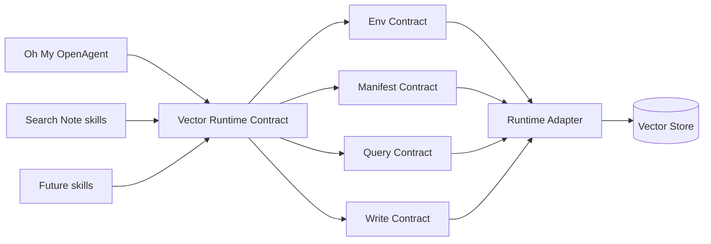

# Vector Runtime Contract Spec

## Status

Draft for `fix/session-search-sql-vector`。

## Goal

Vector search integration 必须通过一份稳定的运行时契约被 Oh My OpenAgent 与本地 Search Note skills 共享，而不是直接耦合到某个脚本、仓库路径或本机实现细节。两端都可以 query，也都可以写入 derived vector data，但所有 query 与 write 都必须遵守同一套 environment、manifest、schema 和 operation contract。

## Non-Goals

- 不让 Oh My OpenAgent 依赖 Search Note 的内部 Python 实现。
- 不让 Search Note 依赖 Oh My OpenAgent 的 TypeScript 实现。
- 不在 vector indexing 过程中修改 OpenCode source database。
- 不把 user home、repo checkout 或 LanceDB-only storage assumption 硬编码进 caller。
- 不允许多个 writer 各自发明不兼容的 chunk ID、schema、manifest 或 embedding setting。

## Core Principle

```text
Share the contract, not the implementation.
```

Oh My OpenAgent、Search Note 与未来的本地 skills 只耦合到 `Vector Runtime Contract`。Runtime adapter 决定 backing store 是本地 LanceDB、远端 Qdrant、其他 vector database，还是 test fixture。



## Env Contract

环境变量只描述 runtime wiring，不承载 source-specific business logic。

| Variable | Required | Meaning |
|---|---:|---|
| `AGENT_KNOWLEDGE_ROOT` | no | Derived agent knowledge state 的逻辑根目录。 |
| `AGENT_VECTOR_DB_BACKEND` | no | Vector backend 标识，例如 `lancedb` 或 `qdrant`。 |
| `AGENT_VECTOR_DB_PATH` | no | Filesystem backend 使用的本地 vector database path。 |
| `AGENT_VECTOR_DB_URI` | no | Service backend 使用的远端 vector database URI。 |
| `AGENT_VECTOR_DB_API_KEY` | no | Vector database credential。 |
| `AGENT_VECTOR_MANIFEST` | no | Manifest file path 或 URI。 |
| `AGENT_EMBEDDING_ENDPOINT` | no | Embedding API endpoint。 |
| `AGENT_EMBEDDING_API_KEY` | no | Embedding API credential。 |
| `AGENT_EMBEDDING_MODEL` | no | Query vector 与 indexed chunk 使用的 embedding model。 |
| `AGENT_EMBEDDING_DIMENSIONS` | no | Embedding vector dimension count。 |
| `AGENT_VECTOR_SOURCE` | no | Source namespace filter，例如 `markdown`、`opencode`、`facts` 或 `all`。 |
| `AGENT_VECTOR_TIMEOUT_MS` | no | Query 或 write operation 的 timeout budget。 |

默认本地布局可以继续是：

```text
~/.cache/agent-knowledge/Zettelkasten/lancedb/
~/.cache/agent-knowledge/Zettelkasten/*-manifest.json
```

Caller 必须把这些路径视为 default only。显式环境变量永远优先。

## Manifest Contract

Manifest 是 query vector、stored vector、source schema 与 writer behavior 之间的兼容性校验点。Runtime 在返回 semantic results 或执行 write 前必须校验 manifest。

```json
{
  "contract_version": "vector-runtime/v1",
  "backend": "lancedb",
  "db_path": "~/.cache/agent-knowledge/Zettelkasten/lancedb",
  "embedding": {
    "provider": "http",
    "endpoint": "http://example.internal/v1/embeddings",
    "model": "BAAI/bge-small-zh-v1.5",
    "dimensions": 512
  },
  "sources": {
    "opencode": {
      "table": "opencode_sessions",
      "schema_version": "opencode-session-chunk/v1",
      "source_of_truth": "opencode.db",
      "last_indexed_at": "2026-05-12T00:00:00+08:00"
    },
    "markdown": {
      "table": "chunks",
      "schema_version": "markdown-chunk/v1",
      "source_of_truth": "filesystem",
      "last_indexed_at": "2026-05-12T00:00:00+08:00"
    }
  }
}
```

## Invariants

- `INV-1`: Query vector 必须使用与目标 source table 相同的 embedding model 与 dimensions 生成。
- `INV-2`: Write 必须拒绝 schema version 与目标 source namespace 不匹配的 chunks。
- `INV-3`: 相同 source object 与 chunk content 必须生成 deterministic chunk ID。
- `INV-4`: Source database 与 source files 始终是 source of truth；vector tables 是 derived 且可重建。
- `INV-5`: Runtime caller 不能只因为 vector query 成功就推断 index fresh；freshness 只能来自 manifest。
- `INV-6`: 多个 caller 可以写入，但必须使用同一套 write protocol 与 manifest update rules。

## Source Namespace Contract

每一条 vector row 都属于一个 `source` namespace。已知 namespace：

| Source | Source of Truth | Typical Table | Chunk Identity |
|---|---|---|---|
| `opencode` | OpenCode SQLite database | `opencode_sessions` | `session_id + message_id + chunk_hash` |
| `markdown` | Markdown files | `chunks` | `absolute_path + heading_path + chunk_hash` |
| `facts` | Agent fact Markdown files | `facts` or `chunks` | `fact_id + chunk_hash` |

Minimum row fields：

| Field | Required | Meaning |
|---|---:|---|
| `source` | yes | Source namespace。 |
| `chunk_id` | yes | Namespace 内 deterministic unique ID。 |
| `chunk_text` | yes | 被 embedding 的文本。 |
| `embedding` | yes | 由 manifest embedding settings 生成的 vector。 |
| `metadata` | yes | Source-specific structured metadata。 |
| `chunk_hash` | yes | 用于 incremental update decision 的 content hash。 |
| `indexed_at` | yes | Index write timestamp。 |
| `schema_version` | yes | Source row schema version。 |

## Query Contract

Query caller 提交 normalized request：

```json
{
  "query": "DeepSeek ksyun training",
  "source": "opencode",
  "mode": "semantic",
  "top_k": 10,
  "filters": {
    "session_id": "optional-session-id"
  }
}
```

Runtime adapter 返回 normalized results：

```json
{
  "results": [
    {
      "source": "opencode",
      "chunk_id": "session:message:hash",
      "score": 0.87,
      "text": "matched chunk text",
      "metadata": {
        "session_id": "ses_xxx",
        "message_id": "msg_xxx",
        "title": "Session title"
      }
    }
  ],
  "diagnostics": {
    "backend": "lancedb",
    "manifest_validated": true,
    "semantic_available": true
  }
}
```

Semantic query failure 必须降级为 no semantic results + diagnostics。它不能静默查询无关 Markdown、临时 rebuild index，或通过意外 fallback path 读取 source database。

## Write Contract

Runtime 支持 multiple writers through one shared protocol。这不是 single-writer ownership，而是 single write semantics。

```text
Single Write Contract, Multiple Writers.
```

Allowed writers 包括 Oh My OpenAgent、Search Note 与未来 skills。所有 writer 必须遵守同一协议步骤。

### Step 1: Resolve Runtime

Writer 从 Env Contract 解析 backend、database location、embedding settings、manifest location、timeout 与 source namespace。

### Step 2: Validate Manifest

Writer 校验 `contract_version`、backend compatibility、embedding model、dimensions、source table 与 schema version。若目标 source namespace 不存在，writer 只能通过同一 manifest schema 初始化它。

### Step 3: Build Chunks

Writer 将 source records 转为包含 deterministic `chunk_id`、`chunk_text`、`metadata`、`chunk_hash` 与 `schema_version` 的 rows。

### Step 4: Embed Chunks

Writer 使用 manifest-compatible embedding runtime 生成 embeddings。若 embedding dimensions 异常，writer 必须拒绝写入。

### Step 5: Apply Delta

Writer 通过 `source + chunk_id` 执行 upsert 与 delete。Delete 用于移除 source object 已不存在或 chunk identity 已变化的 derived chunks。

### Step 6: Commit Manifest

Writer 必须与 vector table update 原子地或紧随其后更新 freshness 与 source statistics。部分更新完成的 vector table 不能被报告为 fresh。

## Concurrency Contract

Runtime adapter 必须提供以下并发保证之一：

| Backend Shape | Required Guarantee |
|---|---|
| Local filesystem backend | Process-level writer lock + atomic manifest replace。 |
| Remote vector service | Backend transaction、compare-and-swap revision 或等价 optimistic concurrency。 |
| Test fixture | Deterministic single-process behavior。 |

如果 backend 能隔离 table 与 manifest updates，不同 source namespace 的并发 writer 可以并行。同一 source namespace 的并发 writer 必须 serialize，或 fail fast 并返回 retryable diagnostic。

## Security Contract

- API keys 从 environment variables 或 runtime configuration 指向的 local secret files 读取。
- API keys 不得写入 manifests、vector rows、logs、diagnostics 或 test fixtures。
- Query diagnostics 可以包含 provider name、backend name、model name 与 dimensions，但不能包含 credentials。

## Oh My OpenAgent Integration Boundary

Oh My OpenAgent 作为 contract consumer 调用 runtime：

- Query 时提交 `source=opencode`、`mode=semantic`、`top_k` 与 optional filters。
- Write 时提交从 OpenCode session data 派生出的 `source=opencode` chunks。
- Fallback 时保持 direct OpenCode SQLite keyword search 与 vector runtime availability 独立。

Oh My OpenAgent 不得在 public tool behavior 中要求 Search Note checkout、hard-coded Python file path 或 LanceDB-specific table name。

## Search Note Integration Boundary

Search Note 同样作为 contract consumer 调用 runtime，并且可以提供 runtime adapter 的一种实现。它的 Markdown 与 OpenCode index builders 必须发布 Oh My OpenAgent 可校验的 manifest entries，而不是要求 Oh My OpenAgent import Search Note internals。

## Failure Modes

| Failure | Required Behavior |
|---|---|
| Missing manifest | Query 返回 no semantic results；explicit write operation 才能初始化。 |
| Embedding model mismatch | 拒绝该 source namespace 的 query 或 write。 |
| Dimension mismatch | 拒绝该 source namespace 的 query 或 write。 |
| Missing vector table | Query 返回 no semantic results；explicit writer 可以初始化。 |
| Stale manifest | 只在 diagnostics 中标明 freshness 后返回结果。 |
| Concurrent write conflict | Fail fast with retryable diagnostics；不得破坏 manifest。 |
| Missing credential | 返回 no semantic results，或拒绝 write 并给出 credential diagnostics。 |

## Compatibility With Current Session Search

当前 `session_search` implementation 可以继续把 Search Note adapter 当作 bridge。Bridge 后续应通过 environment-driven runtime resolution 与 manifest validation 收敛到本 contract，替代 script-path coupling。

## Acceptance Criteria

- Oh My OpenAgent 与 Search Note 可以通过环境变量指向同一个 vector runtime。
- Query 与 write operation 都会在使用前校验 manifest compatibility。
- 多个 writer 只能通过共享 Write Contract 写入 derived vector data。
- Source data 保持 authoritative；vector data 保持 derived and rebuildable。
- Credentials 不进入 Git、manifests、vector rows 或 logs。

# References

- `docs/specs/session-search-hybrid.md`
- `src/tools/session-manager/vector-adapter.ts`
- Search Note `query_lancedb.py` 与 index builders（当前 bridge implementation）
